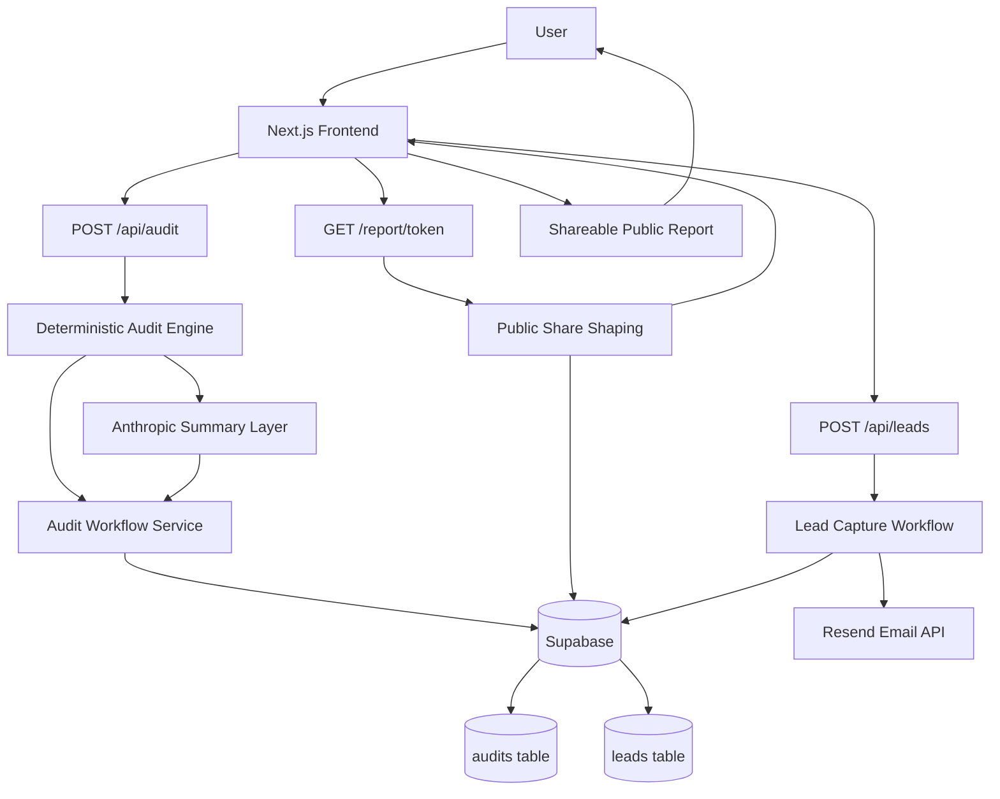

# Architecture

## 1. Project Overview

Stack Audit is a Next.js SaaS MVP for analyzing AI tooling spend and producing procurement-style optimization recommendations for startup teams. The product is intentionally split into two layers:

- A deterministic audit engine that evaluates pricing, seats, and usage intensity.
- A lightweight AI summary layer that explains the deterministic result in plain business language.

That split is the core engineering decision in the product. Savings math, recommendation ordering, and plan selection are code-driven and testable. Anthropic is used only to summarize the result, not to decide the result.

The current product supports:

- audit input and recommendation generation
- persistence of audits and leads in Supabase
- privacy-safe public report sharing
- optional confirmation email delivery through Resend
- automated CI checks and Vitest coverage around recommendation quality and workflow integrity

No website builders are used. No admin dashboard templates are used. The UI and application flow are custom React/Next.js code.

## 2. System Architecture Diagram

## 3. Audit Recommendation Data Flow

### Step-by-step flow

1. User submits team size, primary use case, tool list, plan, seats, monthly spend, and usage intensity.
2. The audit engine converts usage intensity into a numeric usage weight.
3. The engine loads pricing metadata for the selected tool and current plan.
4. It checks whether the current plan appears oversized for the stated team and workflow.
5. It tries a same-vendor downgrade first.
6. It separately evaluates seat reduction opportunities.
7. It then considers limited vendor-switch scenarios.
8. For API-priced tools, it can return a credit-opportunity recommendation instead of inventing unsupported savings.
9. It computes optimized spend, monthly savings, and annual savings using deterministic pricing logic.
10. It builds finance-style recommendation reasoning and an overall assessment.
11. Anthropic generates a concise summary from the deterministic result, with a tested fallback summary if the model is unavailable.
12. The audit plus summary is persisted in Supabase with a unique share token.
13. The API returns a shareable report payload and public report URL.

### Why deterministic logic was used

Pricing recommendations are a trust-sensitive part of the product. The audit engine therefore keeps the decision logic inside application code:

- usage intensity is mapped to explicit numeric weights
- plan transitions are based on real plan metadata in `lib/pricing-data.ts`
- recommendation ordering is explicit in `evaluateToolRecommendation`
- savings are calculated directly from known monthly prices or preserved as current spend when defensible pricing is unavailable

### Why AI was not used for pricing calculations

The repository deliberately avoids asking a model to:

- infer pricing
- guess downgrade paths
- estimate API savings from vague descriptions
- choose recommendations from ambiguous prompts

That work is handled by TypeScript logic so the output is reproducible, testable, and constrained by known pricing data.

### Why this makes recommendations more trustworthy

This approach makes the product easier to review and harder to overclaim:

- the same input yields the same recommendation
- non-negative savings are enforced in tests
- API tools do not receive fake downgrade math
- already-optimized stacks can honestly return `maintain`

For a procurement-style product, that is more valuable than a more “creative” AI-first recommendation flow.

## 4. Tech Stack + Why Chosen

### Application stack

- Next.js App Router
  Why: combines server rendering, API routes, metadata generation, and deploy-ready routing in one framework. This is a good fit for a SaaS MVP with marketing pages, form flows, server logic, and public report pages.

- React
  Why: component composition is a strong fit for the multi-section landing page, audit form, report UI, and reusable cards/tables. React also matches the team’s need for iteration speed and predictable UI abstractions.

- TypeScript
  Why: critical domain objects such as `AuditFormValues`, `ToolRecommendation`, `AuditReport`, and `PublicAuditReport` benefit from explicit types. This reduces risk in a product where calculation output must stay structurally correct across API, persistence, and UI layers.

- Tailwind CSS
  Why: fast iteration, consistent utility-driven styling, and small surface area for a custom MVP UI without adding a heavy design system dependency.

- Supabase
  Why: simple hosted Postgres-backed persistence for audits and leads, with low operational overhead for an MVP and a clear path to production data ownership.

- Anthropic API
  Why: used only for concise business-facing report summaries, not for pricing logic. This keeps the AI integration narrow and controlled.

- Resend
  Why: lightweight transactional email delivery for report confirmation and follow-up workflows.

- Vercel
  Why: natural deployment target for a Next.js App Router product with server-rendered pages, API routes, and fast frontend iteration.

- GitHub Actions
  Why: the repository already includes a `ci.yml` workflow that runs on pushes to `main`, installs dependencies, lints, and runs tests.

- Vitest
  Why: fast TypeScript-friendly unit and workflow testing with minimal setup overhead. This repo uses Vitest, not Jest.

## 5. Why Next.js Was Chosen

Next.js is a practical fit for this product because Stack Audit is not just a static website and not just an API.

The application needs:

- a marketing homepage
- an interactive audit flow
- server-side report loading by share token
- metadata for public share pages
- API endpoints for audit generation, lead capture, and summary generation

App Router allows those concerns to live in one codebase with a shared type system and deployment model. It also makes server rendering straightforward for public report pages and marketing content, which is valuable for both perceived performance and shareability.

For an MVP, this reduces infrastructure sprawl and keeps the boundary between UI and server logic small.

## 6. Why TypeScript Was Chosen

TypeScript is important here because the product has a real domain model, not just UI state.

Examples from the codebase:

- audit input shape is validated against `AuditFormValues`
- recommendation records carry structured fields like `actionType`, `confidence`, and `optimizedSpend`
- persisted audit rows are reconstructed into presentation-safe report objects
- public share reports intentionally expose a narrower type than internal audit reports

Those types help in three places:

- correctness of pricing/report data flow
- maintainability of UI and API integrations
- reviewer confidence that recommendation objects are explicit, not ad hoc JSON blobs

This is especially useful in a deterministic recommendation engine where hidden field drift would be costly.

## 7. Database Design

The persistence layer is intentionally small. The repository currently works with two tables through `createSupabaseAuditRepository()`.

### `audits`

Purpose:

- store original tool inputs
- store deterministic recommendation output
- store generated summary text
- store a share token for public retrieval

Persisted fields used in code:

- `id`
- `tools`
- `team_size`
- `primary_use_case`
- `current_monthly_spend`
- `optimized_monthly_spend`
- `total_monthly_savings`
- `total_annual_savings`
- `recommendations`
- `ai_summary`
- `share_token`
- `created_at`

### `leads`

Purpose:

- capture email-based follow-up intent tied to an audit
- prevent duplicate submissions per audit/email pair

Persisted fields used in code:

- `id`
- `audit_id`
- `email`
- `company_name`
- `role`
- `created_at`

### Design notes

- JSON columns are used for `tools` and `recommendations`, which is acceptable for an MVP because the main access pattern is by audit token or audit id, not analytical querying over nested fields.
- `share_token` is the critical lookup field for public reports.
- Leads are linked back to audits by `audit_id`.
- The repository can use a readonly client for public fetches and a service-role client for writes.

## 8. AI Integration Strategy

The AI integration is intentionally narrow.

### What Anthropic does

- converts deterministic audit output into a concise summary paragraph
- explains the strongest recommendation in startup-friendly business language
- falls back to a deterministic summary when no client is configured, the request times out, or the API fails

### What Anthropic does not do

- select plans
- calculate savings
- infer pricing
- decide whether a tool should be maintained, downgraded, resized, or switched

This strategy keeps AI useful without making it authoritative over finance-sensitive output.

## 9. Public Share + Privacy Model

The system distinguishes between internal audit data and public report data.

Internal audit reports include fields like:

- team size
- share token
- lead association
- full persisted audit metadata

Public report shaping in `lib/share.ts` removes or excludes sensitive fields and produces a narrower `PublicAuditReport`.

The public-share model is designed around:

- privacy-safe DTO generation
- human-readable share title and description
- public report retrieval by share token
- no email, company name, role, or internal lead metadata in the public payload

This separation is important because the product encourages reports to be shared externally with founders, finance stakeholders, or operators.

## 10. Abuse Protection

The MVP uses lightweight abuse protection rather than a heavy anti-bot stack.

Current implemented protections include:

- honeypot field on lead capture (`website`)
- silent filtering of submissions when the honeypot is filled
- email normalization to reduce duplicate variance
- duplicate detection by audit and normalized email
- basic payload validation on API routes

This is appropriate for the current product stage: simple, low-friction, and already covered by tests.

## 11. Scalability Considerations (10k audits/day)

The current architecture is reasonable for an MVP, but 10k audits/day would change a few decisions.

### What already scales reasonably well

- deterministic audit calculation is CPU-light and synchronous
- public report reads are simple token lookups
- the data model is small
- the frontend is mostly server-rendered or static for marketing/report entry points

### What would likely change

- AI summary generation would move off the request path
  Reason: synchronous LLM calls become the highest-latency external dependency. A queue-backed job model would let the deterministic report return immediately and attach the AI summary asynchronously.

- background jobs would be introduced
  Likely use cases: summary generation, email delivery, retry handling, and analytics events.

- Redis or another cache layer would become useful
  For: repeated public report reads, transient rate-limit state, and possibly caching stable report payloads by share token.

- rate limiting would move from lightweight validation to explicit policy
  Particularly on `/api/audit`, `/api/leads`, and `/api/summary`.

- database indexing would matter more
  At minimum: unique or indexed access on `share_token`, indexes on `audit_id` and normalized lead email paths.

- monitoring and structured logging would be added
  Especially around summary generation failures, Supabase latency, API error rates, and queue backlog.

- the audit engine could be split into its own service if needed
  Not because the logic is too large today, but to isolate scaling and deployment concerns if audit generation throughput diverges from page traffic.

- CDN caching would become more intentional
  Public share pages and static assets are good candidates for more aggressive edge caching.

At 10k audits/day, the recommendation engine itself is not the main scaling risk. External integrations, request concurrency, retries, and operational visibility are the larger concerns.

## 12. Testing Strategy

The repository uses Vitest and currently focuses on high-signal business logic and workflow correctness.

Covered areas include:

- deterministic audit-engine recommendation behavior
- non-negative pricing validation
- honest maintain behavior for optimized stacks
- same-vendor downgrade preference over marginal vendor switching
- API credit-opportunity handling
- Anthropic fallback and successful-response behavior
- public-share sanitization
- persistence and lead workflow integrity
- honeypot filtering and duplicate prevention

This is a sensible testing shape for an MVP because the highest-risk failures are recommendation trust issues and persistence/lead workflow regressions, not visual snapshot drift.

## 13. Deployment Architecture

The intended deployment shape is:

- Vercel hosting the Next.js application
- App Router pages for frontend and public report rendering
- server-side API routes for audit creation, summary generation, and lead capture
- Supabase as the backing data store
- Anthropic and Resend as outbound service dependencies

Operationally, this keeps the system simple:

- one web application
- one primary database platform
- two narrow external integrations

That is a good match for a real MVP: enough structure to ship a product, but not a premature microservice setup.

## 14. Lighthouse + Performance Notes

Recent work in this repository focused on rendering stability and mobile performance rather than a broad UI rewrite.

Implemented themes in the codebase now include:

- reduced CLS by removing hidden-on-load hero motion and hydration-driven counter jumps
- more stable font loading through `next/font`
- lighter above-the-fold animation behavior
- reduced unnecessary client-side work on the landing experience
- responsive, mobile-first layouts with stable component sizing
- server rendering for public entry points and report loading
- minimizing hydration where possible, especially for static landing content

The intended Lighthouse targets are:

- Performance >= 85
- Accessibility >= 90
- Best Practices >= 90

From an architecture perspective, the important takeaway is not a single score number. It is that the application is being shaped toward:

- deterministic first paint for critical content
- minimal layout movement
- limited client hydration
- clear separation between interactive and non-interactive UI concerns

That aligns well with the product: a polished startup-facing interface that still behaves predictably under review.
